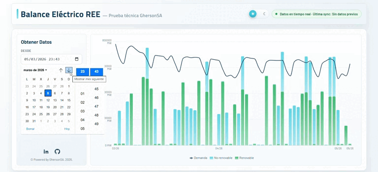

# REE Balance - Prueba Técnica Fullstack

## Demo



Solución fullstack para capturar, almacenar y visualizar datos del balance eléctrico nacional a partir de la API pública de REE.

Este README está redactado en español porque el proyecto corresponde a una prueba técnica para el proceso de evaluación.

El proyecto fue desarrollado con un enfoque de ingeniería orientado a producción: separación clara de responsabilidades, validación estricta, captura determinista de datos, persistencia SQL, observabilidad operativa y una interfaz centrada en legibilidad analítica.

## Alcance

- API backend desarrollada con NestJS (TypeScript)
- Persistencia histórica en PostgreSQL
- SPA en React (TypeScript) para visualización interactiva
- Configuración completa con Docker Compose (base de datos, backend y frontend)
- Pruebas automatizadas en backend y frontend
- Documentación de API con Swagger/OpenAPI

## Visión de Arquitectura

### Backend

- NestJS con diseño modular (BalanceModule, ReeModule)
- TypeORM para persistencia y composición de consultas
- ScheduleModule para sincronización periódica
- Validación global mediante ValidationPipe (whitelist + transform + rechazo de propiedades no permitidas)
- Estrategia de reintentos y degradación controlada ante fallos de REE

### Frontend

- React 19 + TypeScript + Vite
- @tanstack/react-query para gestión de estado de servidor
- Recharts para visualización de series temporales
- Componentización por responsabilidad (filtros, gráfico, estado de sincronización)

### Infraestructura

- docker-compose.yml define y coordina:
  - db (PostgreSQL 16)
  - backend (NestJS en puerto 3000)
  - frontend (Nginx sirviendo build estática en puerto 4173)

## Pipeline de Datos

1. Las solicitudes entran por /api/v1/balance.
2. El backend valida y normaliza la entrada (startDate, endDate, timeTrunc e indicatorType opcional).
3. La sincronización (POST /api/v1/balance/sync o cron horario) consulta REE con parámetros obligatorios.
4. La respuesta se transforma a un modelo normalizado (timestamp, indicador, valor, porcentaje, unidad y nivel de agregación).
5. Los registros se guardan con upsert en PostgreSQL usando clave de conflicto única:
   - (timestamp, indicatorType, timeTrunc)
6. Se registran metadatos en ree_ingest_logs para trazabilidad.
7. Si REE no está disponible, la API devuelve estado stale con lastSyncAt de la última sincronización exitosa.

## Modelo de Datos

### balance_points

Tabla principal de series temporales.

- id (uuid, PK)
- timestamp (timestamptz)
- indicatorType (varchar)
- indicatorName (varchar)
- value (numeric)
- percentage (numeric, nullable)
- unit (varchar, nullable)
- timeTrunc (varchar)
- source (varchar, por defecto ree)
- createdAt, updatedAt

Índices:

- idx_balance_point_timestamp
- idx_balance_point_indicator_type
- restricción única uq_balance_point_ts_type_trunc

### ree_ingest_logs

Tabla de auditoría operativa de sincronizaciones.

- id (uuid, PK)
- requestStart, requestEnd
- timeTrunc
- status (success | error)
- errorMessage (nullable)
- payload (jsonb, nullable)
- fetchedAt

## Endpoints de API

URL base: http://localhost:3000

- GET /health
  - Endpoint de salud del servicio

- GET /api/v1/balance
  - Consulta datos por rango temporal
  - Query params:
    - startDate (ISO string, requerido)
    - endDate (ISO string, requerido)
    - timeTrunc (day | month, opcional, valor por defecto day)
    - indicatorType (opcional)

- POST /api/v1/balance/sync
  - Fuerza una sincronización para un rango específico
  - Body:
    - startDate (ISO string)
    - endDate (ISO string)
    - timeTrunc (day | month)

## Documentación Swagger

Swagger está disponible en:

- http://localhost:3000/api/docs

La configuración OpenAPI se inicializa durante el arranque del backend y expone el contrato REST de forma interactiva.

## Ejecución con Docker

Desde la raíz del repositorio:

```bash
docker compose up -d --build
```

Puntos de acceso:

- Frontend: http://localhost:4173
- Backend API: http://localhost:3000
- Swagger: http://localhost:3000/api/docs
- PostgreSQL: localhost:5432

Para detener servicios:

```bash
docker compose down
```

## Ejecución Local (sin Docker para servicios de aplicación)

### Backend

```bash
cd backend
npm install
npm run start:dev
```

Las variables requeridas están definidas en backend/.env.example.

### Frontend

```bash
cd frontend
npm install
npm run dev
```

## Testing

### Backend

```bash
cd backend
npm run test
npm run test:e2e
```

### Frontend

```bash
cd frontend
npm run test
npm run test:coverage
```

La cobertura actual incluye lógica de servicio backend (captura de datos, fallback, validación de fechas y consultas) y comportamiento de componentes frontend (estados del gráfico, selector de rango y estado de sincronización).

## Decisiones de Diseño

### Backend

- Se adoptó validación explícita por DTO y pipes globales estrictas para rechazar entradas inválidas desde el borde.
- Se implementó persistencia por upsert para asegurar idempotencia y evitar duplicidad histórica.
- Se separó la bitácora de sincronizaciones para mejorar observabilidad y diagnóstico operativo.
- Se incorporó estrategia de reintento y degradación controlada (stale, lastSyncAt) ante indisponibilidad del proveedor externo.
- Se acotó timeTrunc a day y month para simplificar semántica de consulta y visualización analítica.

### Frontend

- Se priorizó legibilidad analítica por encima de complejidad visual.
- Se eligió una composición de gráfico que permite comparar mezcla de generación y demanda en una sola vista.
- Se añadió etiquetado adaptativo del eje X para evitar solapamiento en rangos extensos.
- Se modelaron estados de loading, error y vacío para mantener claridad operativa en todo momento.
- Se implementó diseño responsivo consistente para desktop, tablet y móvil sin fragmentar el flujo de uso.

## Estructura del Repositorio

```text
ree-balance-electrico-fullstack/
|-- backend/
|   |-- src/
|   |   |-- balance/
|   |   `-- ree/
|   `-- Dockerfile
|-- frontend/
|   |-- src/
|   `-- Dockerfile
|-- docs/
|   `-- assets/
|       `-- ree-gif.gif
`-- docker-compose.yml
```

## Notas

- El endpoint de REE exige parámetros obligatorios; consultas incompletas generan error en origen.
- Si realizas cambios en backend y no se reflejan en contenedor, reconstruye la imagen:

```bash
docker compose up -d --build backend
```